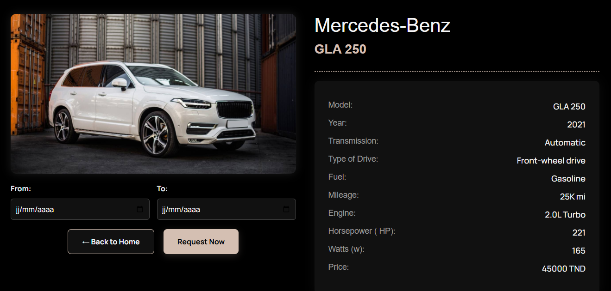
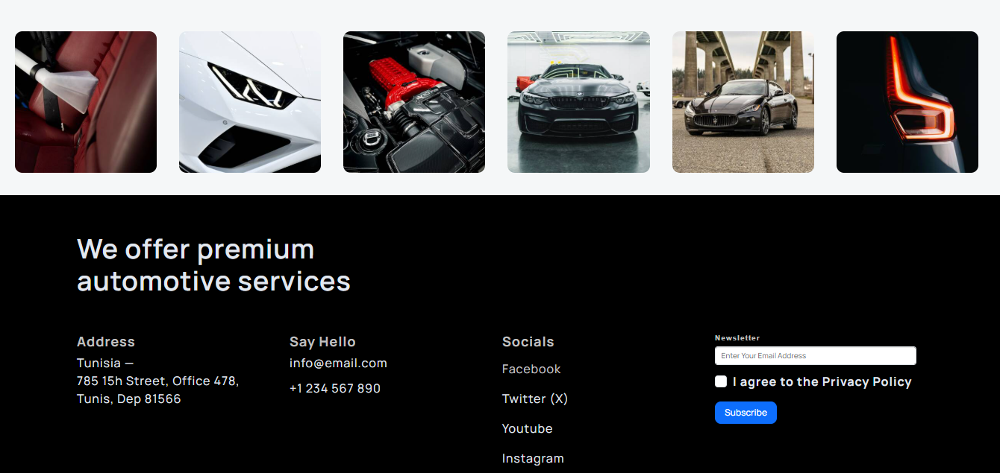
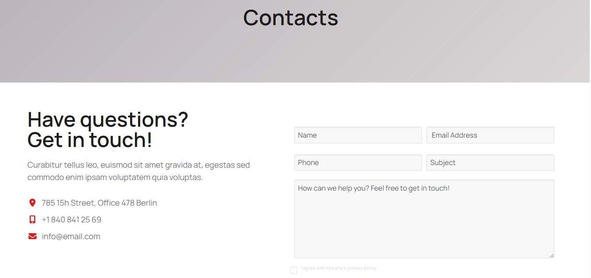

#  🚗 Car Agency Platform 🚗
## A Production-Ready MERN Stack Web Application

### 📌 Overview

**Car Agency Platform** is a full-stack web application built using the **MERN stack** that enables users to browse, search, and view car listings while providing administrators with tools to manage inventory efficiently.

The application follows **modern software architecture**, **RESTful API standards**, and **scalable design principles**, making it suitable for real-world deployment.


### ✨ Features

- 🔐 User Authentication (Login / Register)
- 🚘 Browse Available Cars
- 📄 View Car Details
- 🛠️ Admin Panel for Managing Cars
- 🖼️ Image Upload Support
- 🔍 Search & Filter Cars
- 📱 Fully Responsive Design
- ⚡ RESTful API Architecture

### 🛠️ Tech Stack
#### Frontend
+ ⚛️ React.js
+ 🎨 CSS / Bootstrap
+ 🌐 Axios
+ 🔄 React Router

#### Backend
+ 🟢 Node.js
+ 🚂 Express.js
+ 🍃 MongoDB (Mongoose)
+ 🔐 JWT Authentication

### 📁 Project Structure

``` bash
MERN_car_agency/
│
├── client/        # React frontend
│   ├── src/
│   ├── public/
│   └── ...
│
├── middleware/
│
├── server/        # Express backend
│   ├── models/
│   ├── routes/
│   ├── controllers/
│   └── server.js
│
├── .env
└── package.json
```
### 🚀 Getting Started
#### Prerequisites

Make sure you have installed:
- Node.js
- MongoDB
- npm

### 🔧 Installation

1. Clone the repository
``` bash
git clone https://github.com/your-username/MERN_car_agency.git
```
2. Install backend dependencies
```bash
npm install
```
3. Install frontend dependencies
```bash
cd client
npm install
```
### ▶️ Run the Application
```bash
npm run dev
```
The app will run on:
+ Frontend: http://localhost:3000
+ Backend: http://localhost:5000

### 🔐 Environment Variables

Create a .env file inside the main folder:
```bash
PORT=5000
MONGO_URI=your_mongodb_connection_string
SecretOrKey=your_secret_key
```

### 📸 Screenshots





### 🚀 Future Enhancements
+ Payment integration
+ Booking system
+ Role-based access control
+ Advanced filtering & sorting
+ Admin analytics dashboard

### 🤝 Contributing
Contributions are welcome!
Feel free to fork this repo and submit a pull request.

### 📄 License
This project is licensed under the MIT License.
